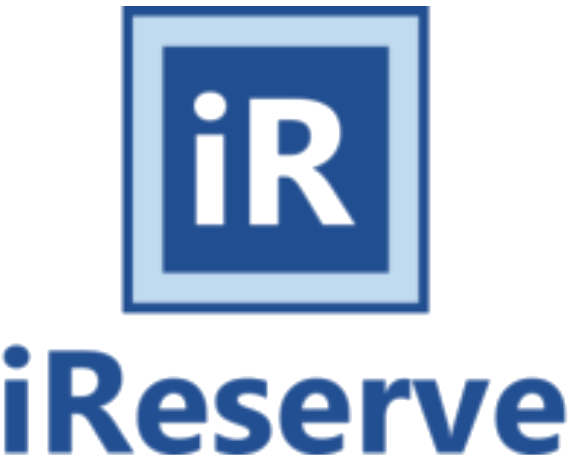
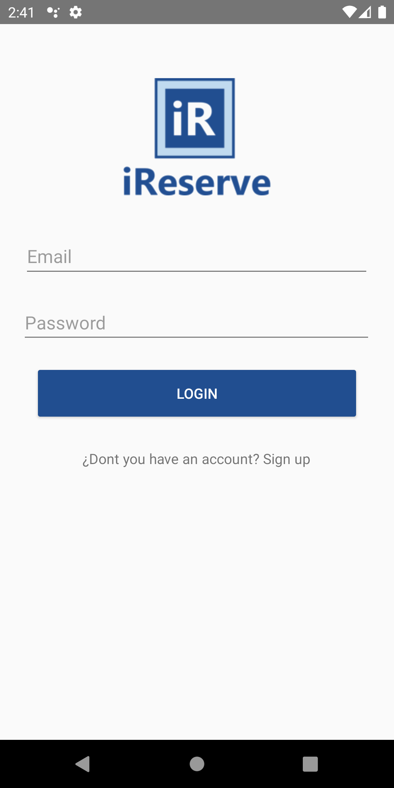
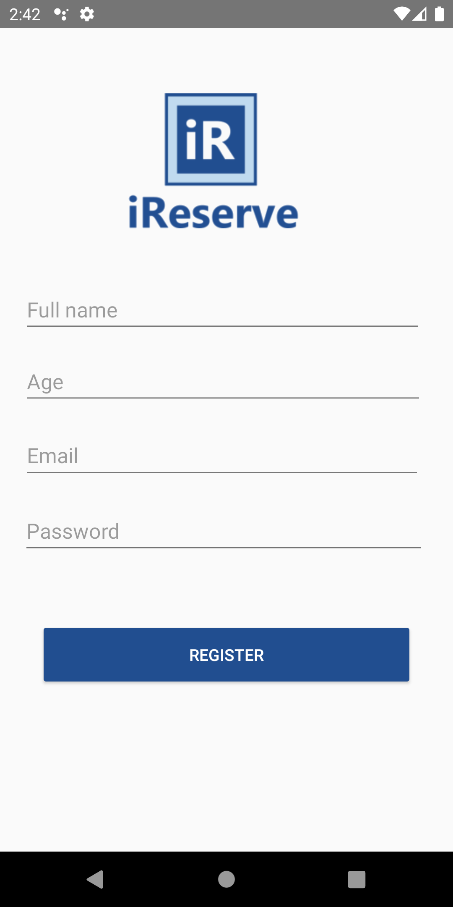
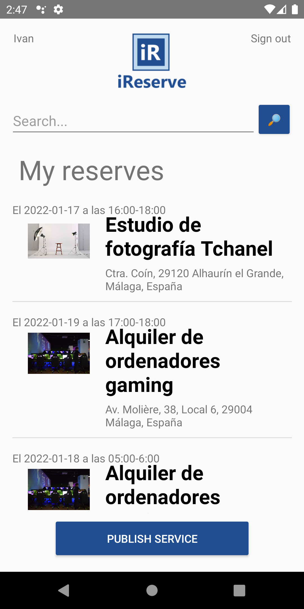
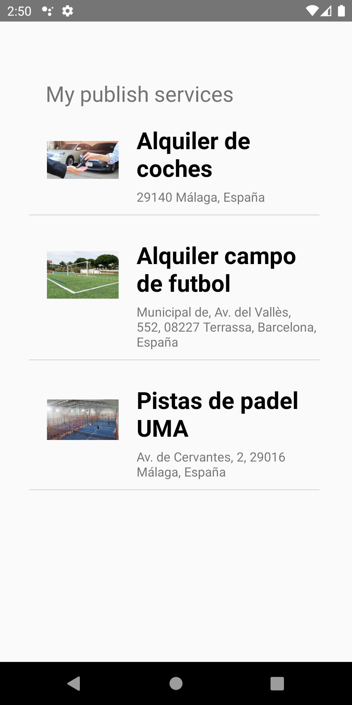
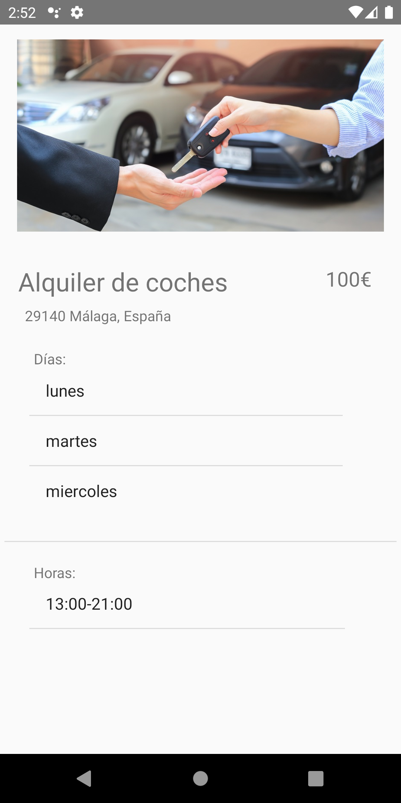
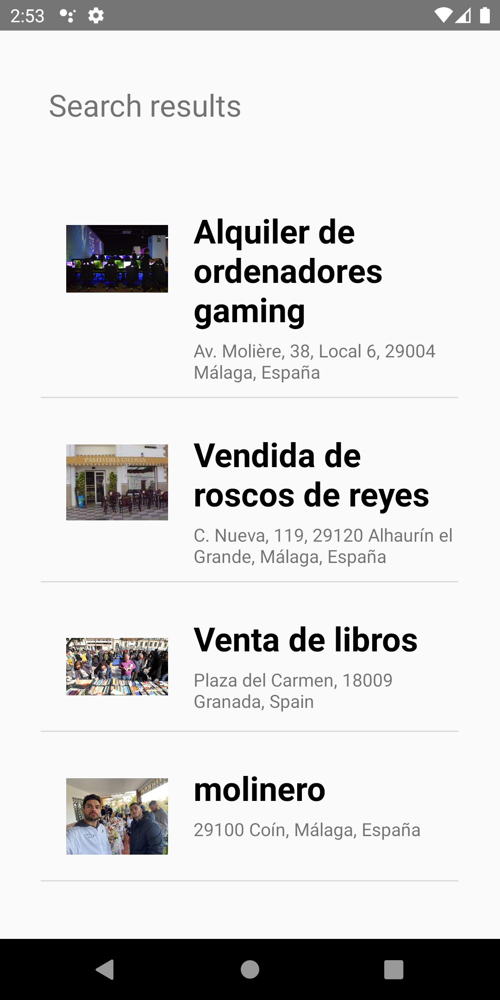
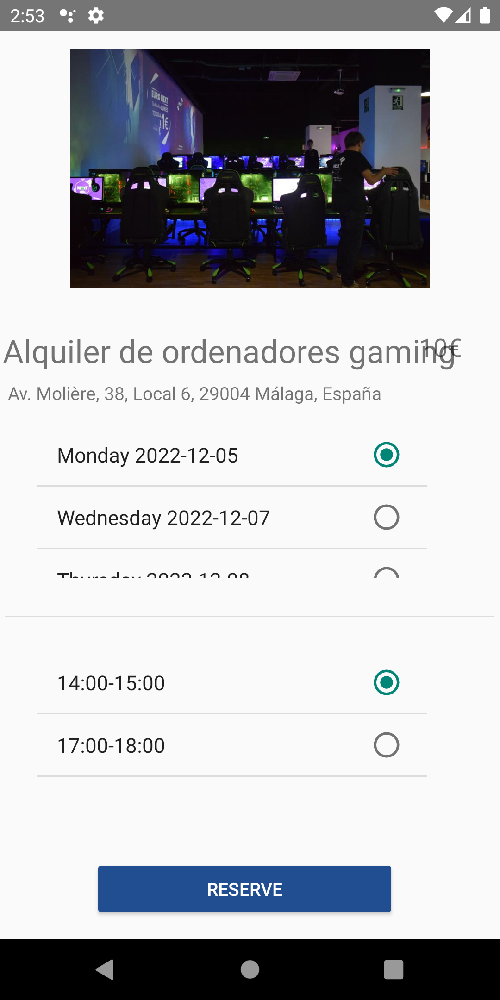
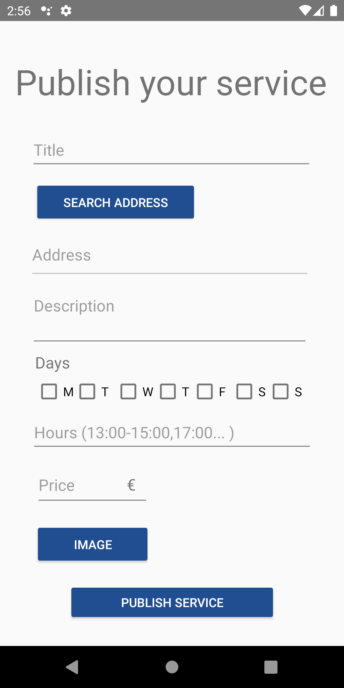

# iReserve

## Definition:

Android application developed in the Java language.
This was my first app developed. It was a University project and I made it with my friend [Rafael Rueda Ruiz](https://github.com/rafaruedaruiz).
The app consists in services that are posted by an user that can be reserved by another user through the app. The app lets login and register, 
create and reserve services and view the services that are created and reserved by an user.

## Features:

- Firebase Authentication
- Firebase Realtime Database
- Firebase Storage
- Spanish and English traductions
- [Place Autocomplete Google Maps API](https://developers.google.com/maps/documentation/places/android-sdk/autocomplete) (Right now Google API is no longer available)

# User Guide

## Login

Login can be done through a previously created account, filling in the fields with the email and password. If you do not have an account, you can create a new one by clicking on the link below.

## Register

In order to register, it is necessary to access the registration section, fill in the fields with a name, age, email and a password with at least 6 digits, and click on "Register". When creating the account, login opens again.

## Home

This is the main page of the app where you can view your reserves, access to your published services, search and create new services, and logout.

## Published services

By clicking username on home page it opens published services. Also if you press the service of the list it will bring more information.

## Search and reserve service

To reserve a service it is needed to press "Search button", although you can put any filter on the text field. 
Then you will have to choose any service and select any timetable to reserve it. It will be added to my services.

## Publish service

Pressing "Publish service" will open a new page where a service can be created. It will be needed to give a title, address, description, days, hours, price and image. 
When the service is published it will be added to my published services 

